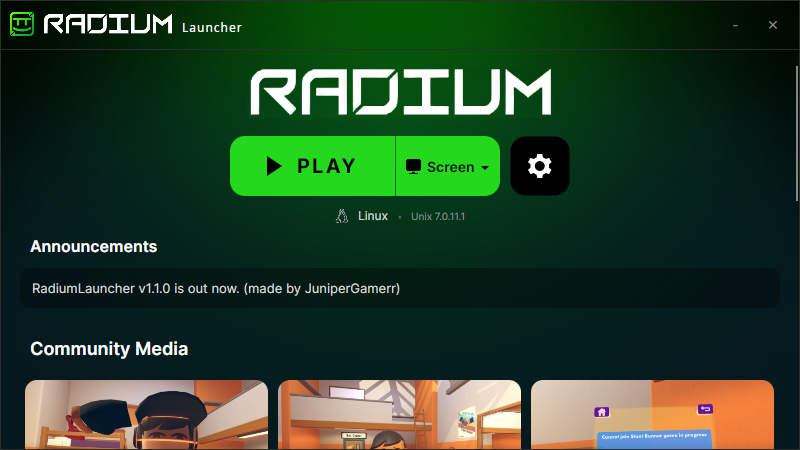

# RadiumLauncher

An unofficial launcher for [Radium](https://radie.app/), a Rec Room revival.

## v1.1.0 Update for RadiumLauncher is here ([JuniperGamerr](https://github.com/JuniperGamerr))
- Announcements area
- New settings options
  - Advanced tab containing custom Batch File paths (for users who don't want to reinstall radium)
  - Radium uninstall capabilities
- Added ETA to download details
- Automatic launcher updates
- UI Changes

## Download

Visit the latest release page for the download: [Latest Release](https://github.com/typxzero/RadiumLauncher/releases/latest).

## OS Compatibility

| Operating System | Compatibility |
| :--- | :--- |
| Windows 10/11 | ✅ Compatible |
| Linux | ✅ Compatible |
| macOS | ❌ Incompatible |

## Features
- Automatic updates
- Automatic patch application
- Integrated community feed
- Custom launch options
- Custom Batch file setup for external Radium installations (windows only)
- Linux support through Proton

## ⚠️ Warning

We are able to change download URLs at any time.
You should check [RadiumLauncherFiles](https://github.com/typxzero/RadiumLauncherFiles) before updating or applying patches through the launcher.
